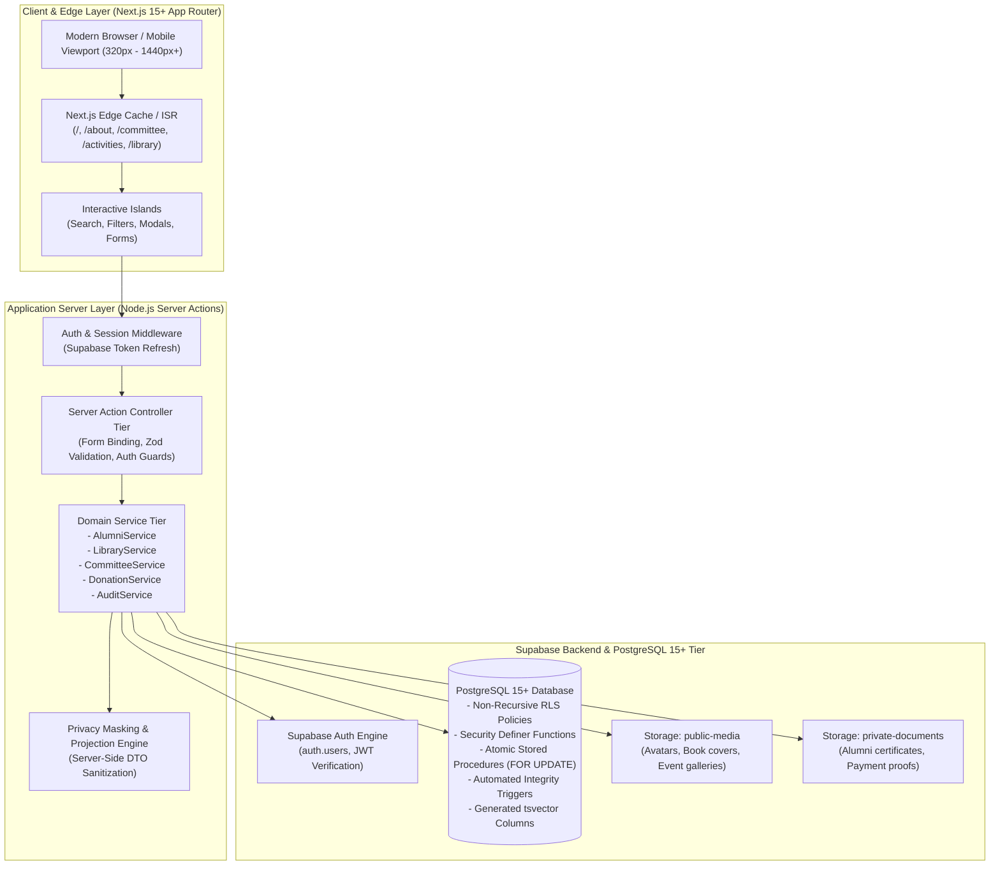
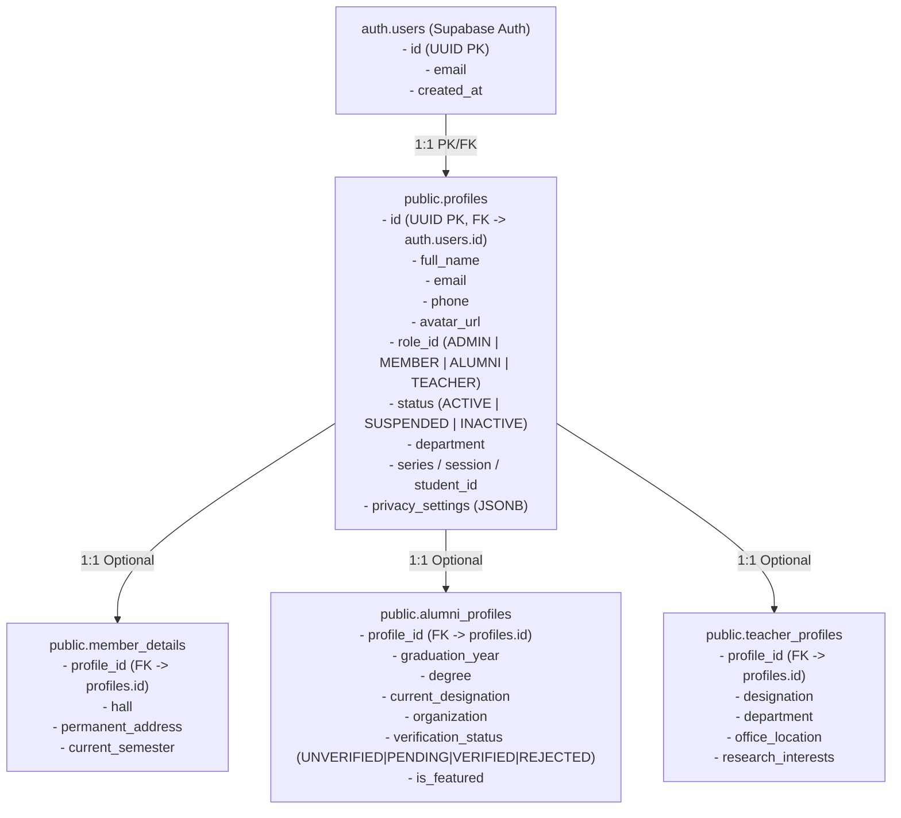

# SIRAJGANJ DISTRICT ASSOCIATION, RUET (SDA RUET)
## System Architecture & Technical Specification Document
**Document Version:** 3.0.0 (Senior Architectural Review & System Hardening)  
**Organization:** Sirajganj District Association, RUET (রাজশাহী প্রকৌশল ও প্রযুক্তি বিশ্ববিদ্যালয় - সিরাজগঞ্জ জেলা সমিতি)  
**Motto:** *"Take a Stand & Hold a Hand"*  
**Primary Visual Identity:** Deep Maroon / Crimson (`#7B2D26` / `#8B3A3A`), Academic Gold / Tan (`#C5A880` / `#D4AF37`), Ivory/Off-white (`#FBF9F5`), Slate Dark (`#0F172A`)

---

## 1. Architectural Review & Hardening Dimensions

As part of the senior architecture review, ten critical system dimensions were rigorously analyzed and resolved:

```
+----------------------------------------------------------------------------------------------------+
|                                 10 SYSTEM ARCHITECTURE PILLARS                                     |
+----------------------------------------------------------------------------------------------------+
| 1. Scalability           : ISR & On-Demand Tag Revalidation, Generated tsvector Columns, CDN Cache |
| 2. DB Normalization      : Snapshot-with-Linkage Committee Model, Traceable Book Copy Lineage      |
| 3. Security              : Non-Recursive Security Definer RLS Functions, Short-Lived Signed URLs   |
| 4. Dynamic RBAC          : Explicit Denials Precedence, Non-Mutating Delegation, Permission Caching|
| 5. Alumni Privacy        : Server-Side DTO Masking, Public DB Projections, Search Privacy Indexing  |
| 6. Library Transactions  : Row Locking (FOR UPDATE), Reservation Conflict Guards, Stock Sync Triggers|
| 7. Data Consistency      : Automated Fund Recalculation Triggers, Copy Condition Reconciliation    |
| 8. File Storage          : Dual-Bucket Partition (Public/Private), Magic-Byte MIME Validation      |
| 9. Performance           : Single-Roundtrip Relational Aggregations, Sub-100ms Edge TTFB           |
| 10. Maintainability      : 3-Tier Layered Decoupling (UI -> Server Actions -> Business Services)   |
+----------------------------------------------------------------------------------------------------+
```

---

## 2. High-Level System Architecture



---

## 3. Deep Architectural Analysis & Mitigations

### 3.1 Dimension 1: Scalability
- **On-Demand Tag Revalidation**: Public pages (`/`, `/committee`, `/activities`, `/library`) use Next.js ISR with tags (`revalidateTag('committee')`, `revalidateTag('library')`). Content updates in the Admin CMS instantly invalidate edge cache without waiting for TTL timers.
- **Generated Full-Text Search Columns**: Rather than computing `search_vector` in application code, PostgreSQL maintains search vectors using `GENERATED ALWAYS AS (to_tsvector('english', coalesce(title, '') || ' ' || coalesce(author, ''))) STORED` with GIN indexing.
- **Per-Request Permission Caching**: Server actions wrap the user's permission lookup inside `React.cache()`, eliminating duplicate database roundtrips during multiple authorization checks in a single render pass.

### 3.2 Dimension 2: Database Normalization & Snapshot Integrity
- **Committee Member "Snapshot-with-Linkage" Pattern**:
  A committee member record (e.g. "General Secretary 2024–2025") stores the member's specific designation, photo, and session for that historical term, while optionally linking to `profile_id`. If the user later updates their personal profile (e.g., changes career or profile picture), historical committee records remain historically accurate.
- **Traceable Book Acquisitions**:
  `book_copies` includes an optional foreign key `donation_id UUID REFERENCES book_donations(id) ON DELETE SET NULL`, preserving end-to-end lineage from community book donations into circulating copies.

### 3.3 Dimension 3: Security & RLS Recursion Prevention
- **Elimination of RLS Infinite Recursion**:
  In PostgreSQL, if an RLS policy on `profiles` calls a function that queries `profiles`, an infinite loop or query degradation occurs. 
  **Solution**: The helper function `auth.user_has_permission()` is declared `SECURITY DEFINER` with `SET search_path = public`, directly querying `public.profiles` and `public.user_permissions` with RLS bypassed internally within the function execution context.
- **Short-Lived Signed URLs**:
  Files in `private-documents` (e.g. alumni graduation certificates) are never exposed via static URLs. Authorized server actions generate 5-minute time-bound signed URLs exclusively for verified administrators or the document owner.

### 3.4 Dimension 4: RBAC & Delegation Precedence
- **Strict 4 Primary Roles**: `ADMIN`, `MEMBER`, `ALUMNI`, `TEACHER`.
- **Dynamic Delegation (Appointed Roles)**: Members/Alumni can be appointed as Librarians or Moderators via granular permission grants without mutating their identity role.
- **Evaluation Order**:
  $$\text{Effective Permissions}(u) = \Big( \text{RolePermissions}(\text{role}(u)) \cup \text{UserGrants}(u) \Big) \setminus \text{UserDenials}(u)$$
  Explicit user denials (`is_granted = FALSE`) take absolute precedence over role-inherited permissions.

### 3.5 Dimension 5: Alumni Privacy & Server-Side Projection
- **No Client-Side Masking Vulnerabilities**:
  Sensitive fields (`phone`, `email`, `student_id`, `permanent_address`, `blood_group`) are stripped on the server before sending JSON to the client.
- **Dedicated Public View**:
  `public.public_alumni_directory` projects only approved alumni records (`verification_status = 'VERIFIED'`) and public fields, completely isolating unverified applicants from queries.
- **Privacy-Safe Full-Text Search**:
  Full-text search vectors on `alumni_profiles` explicitly index only public attributes (`full_name`, `department`, `organization`, `current_city`), preventing adversarial probing of private phone numbers or IDs.

### 3.6 Dimension 6: Library Transaction Integrity & Reservation Guards
- **Atomic Operations with Row-Level Locking (`FOR UPDATE`)**:
  `issue_book_transaction` locks the specific `book_copies` row and the `books` parent row, preventing concurrent checkout races.
- **Reservation Conflict Prevention**:
  `issue_book_transaction` checks `book_reservations`. If an active reservation exists for another user, direct checkout to a walk-in borrower is blocked.
- **Return & Condition Reconciliation**:
  `return_book_transaction` ensures a loan cannot be returned twice, updates copy condition (`GOOD`, `DAMAGED`, `LOST`), and automatically adjusts `available_copies`.

### 3.7 Dimension 7: Automated Data Consistency Triggers
- **Donation Fund Synchronization**:
  A PostgreSQL trigger on `donations` (`AFTER INSERT OR UPDATE OR DELETE`) automatically recalculates and synchronizes `raised_amount` in `donation_funds` when transactions are marked `VERIFIED` or `REFUNDED`.
- **Inventory Stock Rebalancing**:
  An automated trigger on `book_copies` recalculates `available_copies` and `total_copies` whenever copies are added, retired, or damaged.

### 3.8 Dimension 8: Storage Architecture & MIME Validation
- **Segregated Storage Buckets**:
  - `public-media`: Public read via CDN for site banners, book covers, committee photos.
  - `private-documents`: Restricted RLS read for verification certificates and receipts.
- **Server-Side File Validation**:
  Uploads are validated for allowed MIME types (`image/jpeg`, `image/png`, `image/webp`, `application/pdf`), maximum size limits (5MB images, 10MB PDFs), and generated UUID filenames.

### 3.9 Dimension 9: Performance Optimization
- **Single-Roundtrip Relational Aggregations**:
  Complex queries (e.g., Committee Term + Members + Positions) execute in a single relational join using Supabase's PostgREST query projections, eliminating N+1 waterfalls.
- **Database Indexes**:
  B-tree indexes on foreign keys, composite indexes on filter fields (`role_id, status`, `graduation_year, current_city`), and GIN indexes on full-text search columns.

### 3.10 Dimension 10: Maintainability & 3-Tier Layering
```
/src
├── /components & /app          --> UI Presentation Tier (React 19 Server/Client Components)
├── /actions                    --> Server Action Controller Tier (Zod Validation, Session Guards)
├── /services                   --> Domain Business Logic Tier (DB Queries, Stored Procs, Audit Logs)
├── /lib                        --> Infrastructure Clients (Supabase, Email Adapter, Utils)
└── /types                      --> TypeScript Contracts & Database Models
```

---

## 4. Canonical Identity Hierarchy



---

## 5. Complete Route Map & Access Tiers

```
+-------------------------------------------------------------------------------------+
| PUBLIC ROUTES (SSR + ISR)                                                           |
+-------------------------------------------------------------------------------------+
| /                                 : Home (Hero, Motto, Live Stats, Upcoming Events) |
| /about                            : Mission, Vision, Objectives, History, Values    |
| /activities                       : Activity & Blog Directory (Categories, Search)  |
| /activities/[slug]                : Full Article, Gallery, Author Bio               |
| /committee                        : Current Executive Committee (Hierarchical order)|
| /committee/[year]                 : Historical Committee Archive                    |
| /alumni                           : Verified Alumni Directory (Privacy Masked)      |
| /alumni/[id]                      : Alumni Public Profile View                      |
| /library                          : Library Catalog & Real-Time Availability        |
| /library/[id]                     : Book Details & Reservation Modal                |
| /library/donate                   : Book Donation Submission Form                   |
| /donate                           : Multi-Fund Financial Donations (bKash/Nagad/Bank)|
| /contact                          : RUET Campus Location & Contact Form             |
| /members                          : Student Member Directory (Privacy Aware)        |
| /privacy                          : Data Privacy & Visibility Policy                |
| /terms                            : Terms of Service & Library Code of Conduct      |
+-------------------------------------------------------------------------------------+
| AUTHENTICATION ROUTES                                                               |
+-------------------------------------------------------------------------------------+
| /login                            : Role-Aware Login                                |
| /register                         : Student Member Registration                     |
| /register/alumni                  : Alumni Registration + Verification Upload       |
| /forgot-password                  : Password Reset Request                          |
| /reset-password                   : Token Password Update                           |
| /verify-email                     : Email Confirmation Landing                      |
+-------------------------------------------------------------------------------------+
| AUTHENTICATED USER PORTAL (/dashboard/*)                                            |
+-------------------------------------------------------------------------------------+
| /dashboard                        : Role Overview (Member / Alumni / Teacher)       |
| /dashboard/profile                : Profile & Privacy Settings Editor               |
| /dashboard/library                : Active Loans, Due Dates, Renewal Desk           |
| /dashboard/events                 : Registered Events & Digital Tickets             |
| /dashboard/donations              : Contribution History & Receipts                 |
| /dashboard/notifications          : In-App Alerts Feed                              |
| /dashboard/settings               : Account Security & Password Management          |
+-------------------------------------------------------------------------------------+
| ADMIN CONTROL CENTER (/admin/*)                                                     |
+-------------------------------------------------------------------------------------+
| /admin                            : Executive Analytics & Quick Actions             |
| /admin/users                      : User Directory, Role & Permission Delegator     |
| /admin/alumni/applications        : Alumni Verification Queue (Approve/Reject)      |
| /admin/alumni/directory           : Alumni Master Directory & CSV Exporter          |
| /admin/committees                 : Committee Manager & Hierarchy Reorderer         |
| /admin/library/books              : Book Catalog & Copy Barcode Manager             |
| /admin/library/loans              : Circulation Desk (Atomic Issue/Return Ops)      |
| /admin/library/donations          : Book Donations Intake & Cataloging              |
| /admin/library/settings           : Loan Durations, Max Limits & Fine Rates         |
| /admin/activities                 : Activity CMS & Rich Content Editor              |
| /admin/events                     : Event Publisher & Participant Roster            |
| /admin/donations                  : Financial Ledger & Transaction Verifier         |
| /admin/announcements              : Targeted Announcement Broadcaster               |
| /admin/messages                   : Contact Inbox & In-App Replies                  |
| /admin/media                      : Supabase Storage File Manager                   |
| /admin/cms                        : Dynamic Website Copy Editor                     |
| /admin/settings                   : Association Metadata & Social Links             |
| /admin/permissions                : Granular RBAC Matrix Inspector                  |
| /admin/audit-logs                 : Forensic Audit Trail with JSON Diffs            |
+-------------------------------------------------------------------------------------+
```

---

## 6. Implementation Summary & Engineering Standards

- **Strict TypeScript**: 100% type-safe schemas across client, server actions, and database.
- **Production Asset Integration**: Built around official `public/assets/Sda-PNG.png` and `public/assets/ruet_logo.png`.
- **Zero Placeholders**: All components connect to live Supabase PostgreSQL and Server Actions with real transactional integrity.
